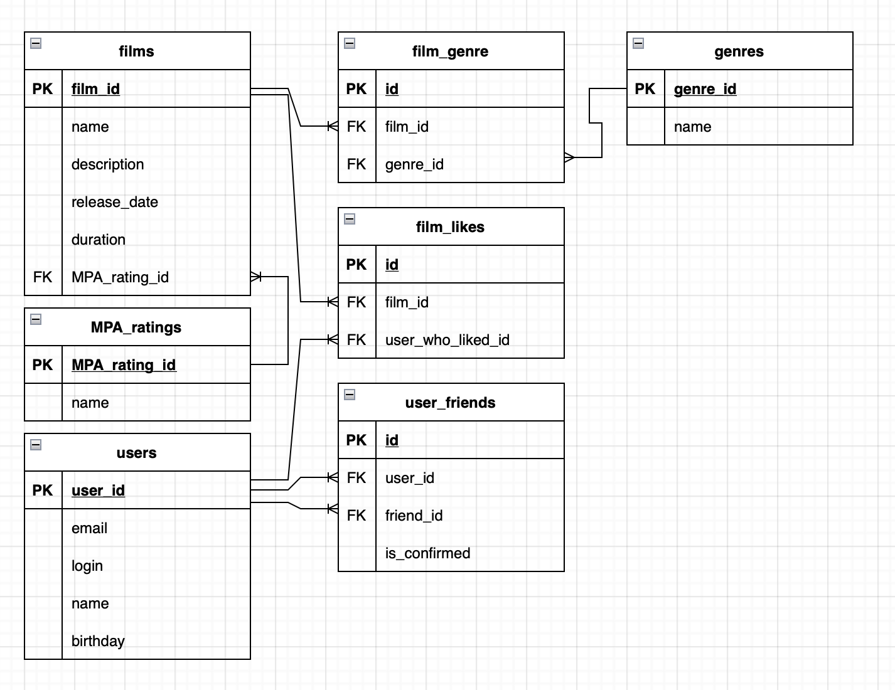

# java-filmorate
### SQL database ER diagram:


### SQL requests examples:

**Get all users:**
```
SELECT * 
FROM users
```
**Get user's friends' id's by userId:**
```
SELECT friend_id
FROM user_friends
WHERE user_friends.user_id = userId
```
**Get common friends' id's for users with id1 and id2:**
```
SELECT friend_id
FROM user_friends
WHERE user_id = id1
  AND user_friends.friend_id IN (SELECT friend_id
                                  FROM user_friends
                                  WHERE user_id = id2) AS id2friends
```
**Get all films:**
```
SELECT * 
FROM films
```
**Get most popular films' id's:**
```
SELECT film_id
FROM film_likes
GROUP BY film_id
ORDER BY COUNT(user_id) DESC
```


